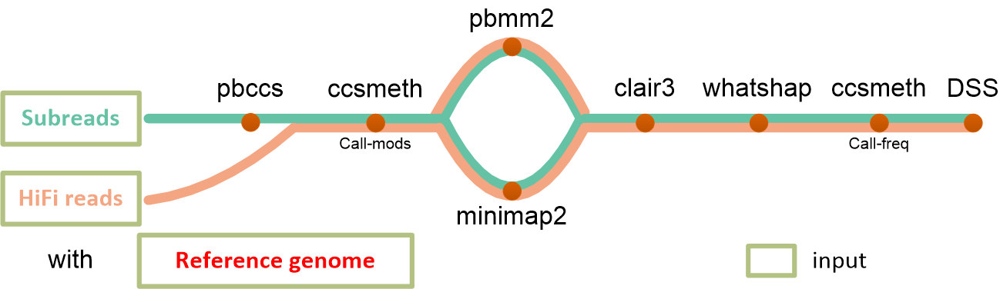

# ccsmethphase

Methylation phasing using PacBio CCS reads

# 


## Contents
* [Installation](#Installation)
* [Demo data](#Demo-data)
* [Input](#Input)
* [Usage](#Usage)
* [Output](#Output)
* [Acknowledgements](#Acknowledgements)
* [TODO](#TODO)


## Installation

Recommended Hardware requirements: 128 GB RAM, 40 CPU processors, 4 TB disk storage

Recommended OS: Linux (Ubuntu etc.)

- (1) Install conda from [Conda](https://docs.conda.io/projects/conda/en/latest/user-guide/install/linux.html) if neeeded.

- (2) Install [nextflow](https://www.nextflow.io/) (version>=21.10.6).

```sh
# create a new environment and install nextflow in it
conda create -n nextflow -c conda-forge -c bioconda nextflow

# OR, install nextflow in an existing environment
conda install -c conda-forge -c bioconda nextflow
```

- (3) Download ccsmethphase from github.

```sh
git clone https://github.com/PengNi/ccsmethphase.git
```

- (4) Install [Docker](https://docs.docker.com/engine/install/) or [Singularity](https://docs.sylabs.io/guides/3.0/user-guide/) if needed.

```sh
# e.g., install singularity using conda
conda install -c conda-forge singularity 
```

- (5) [optional] Install graphviz.

```sh
conda install -c conda-forge graphviz
```


## Demo data
Check [ccsmethphase/demo](/demo) for demo data:
  - _hg002.chr20_demo.hifi.bam_: HG002 demo hifi reads which are aligned to human genome chr20:10000000-10100000.
  - _chr20_demo.fa_: reference sequence of human chr20:10000000-10100000.
  - _hg002_bsseq_chr20_demo.bed_: HG002 BS-seq results of region chr20:10000000-10100000.
  - _input_sheet.tsv_: Information of the demo PacBio bam file _hg002.chr20_demo.hifi.bam_.


## Input
ccsmethphase takes files of PacBio reads (subreads.bam or hifi.bam), and a reference genome as input.

The information of PacBio reads files should be organized into a tsv file, like [input_sheet.tsv](/demo/input_sheet.tsv) in demo data:

| Group_ID | Sample_ID | Type | Path |
| -------- | --------- | ---- | ---- |
| G1       | HG002_demo | hifi | ./demo/hg002.chr20_demo.hifi.bam |
| G1       | HG002_demo | hifi | _path of another flowcell bam file for HG002_demo_ |
| G1       | HG003 | hifi | _path of a bam file for HG003_ |

- **Group_ID**: For group comparation, values can be like _control_, _case_, or anything else.
- **Sample_ID**: The name of the sample sequenced.
- **Type**: Data type, should be _hifi_ or _subreads_.
- **Path**: Path of a (flowcell) bam file sequenced using the sample. **Absolute path** recommended.

**NOTE**: ccsmethphase can be run with conda, docker, and singularity by setting `-profile`. If you are using `-profile conda` to run this workflow, ccsmeth models should be set as input too. Check [ccsmeth](https://github.com/PengNi/ccsmeth) to get ccsmeth 5mCpG models.


## Usage
### Parameters (to be completed):
```text
--dsname:   job name
--input:    the tsv file containing information of PacBio reads files
--genome:   file path of the reference genome
--include_all_ctgs: "true" or "false". default false, , means only [chr][1-22,X,Y] included.
-profile:   conda/docker/singularity, test
```

### Example 1. Run with singularity (recommended)

If it is the first time you run with singularity (e.g. using `-profile singularity`), the following cmd will cache the dafault singularity image (`--singularity_name` and/or `--clair3_singularity_name`) to the `--singularity_cache` directory (default: `local_singularity_cache`) first. There will be `.img` file(s) in the `--singularity_cache` directory.

**NOTE**: If you are using relative paths of bam files in _input_sheet.tsv_, make sure the relative paths are the right relative paths to the directory you launch the workflow.

For the example data:
```sh
# activate nextflow environment
conda activate nextflow

cd /path/to/ccsmethphase
nextflow run main.nf \
    --dsname test \
    -profile singularity,test
```

The above command is equal to the command following:
```sh
nextflow run /path/to/ccsmethphase \
    --dsname test \
    --genome /path/to/ccsmethphase/demo/chr20_demo.fa \
    --input /path/to/ccsmethphase/demo/input_sheet.tsv \
    --include_all_ctgs true \
    --max_cpus 8
    --max_memory "12.GB"
    --max_time "6.h"
    -profile singularity
```

Try the following command to enable GPU:
```sh
CUDA_VISIBLE_DEVICES=0 nextflow run /path/to/ccsmethphase \
    --dsname test \
    --genome /path/to/ccsmethphase/demo/chr20_demo.fa \
    --input /path/to/ccsmethphase/demo/input_sheet.tsv \
    --include_all_ctgs true \
    -profile singularity
```

The downloaded singularity .img file(s) can be re-used, without being downloaded again:
```shell
nextflow run /path/to/ccsmethphase \
    --dsname test2 \
    --genome /path/to/some/other/genome/fa \
    --input /path/to/some/other/input_sheet.tsv \
    -profile singularity \
    --singularity_cache /path/to/local_singularity_cache
```

Try `-resume` to re-run a modified/failed job to save time:
```shell
nextflow run /path/to/ccsmethphase \
    --dsname test \
    --genome /path/to/ccsmethphase/demo/chr20_demo.fa \
    --input /path/to/ccsmethphase/demo/input_sheet.tsv \
    --include_all_ctgs true \
    -profile singularity \
    -resume
```


## Output
The output directory should look like the following:
```text
ccsmethphase_results/
├── pipeline_info
└── test
    ├── bam
    │   ├── G1.HG002_test.hifi.ccsmeth.modbam.pbmm2.merged_size2.SNV_PASS_whatshap.bam
    │   └── G1.HG002_test.hifi.ccsmeth.modbam.pbmm2.merged_size2.SNV_PASS_whatshap.bam.bai
    ├── diff_methyl
    │   ├── G1.HG002_test.hifi.ccsmeth.modbam.pbmm2.merged_size2.SNV_PASS_whatshap.freq.aggregate.hp_callDML.txt
    │   ├── G1.HG002_test.hifi.ccsmeth.modbam.pbmm2.merged_size2.SNV_PASS_whatshap.freq.aggregate.hp_callDMR.autosomes_cf0.2.bed
    │   └── G1.HG002_test.hifi.ccsmeth.modbam.pbmm2.merged_size2.SNV_PASS_whatshap.freq.aggregate.hp_callDMR.txt
    ├── mods_freq
    │   ├── G1.HG002_test.hifi.ccsmeth.modbam.pbmm2.merged_size2.SNV_PASS_whatshap.freq.aggregate.all.bed
    │   ├── G1.HG002_test.hifi.ccsmeth.modbam.pbmm2.merged_size2.SNV_PASS_whatshap.freq.aggregate.hp1.bed
    │   └── G1.HG002_test.hifi.ccsmeth.modbam.pbmm2.merged_size2.SNV_PASS_whatshap.freq.aggregate.hp2.bed
    └── vcf
        ├── clair3_called
        │   ├── G1.HG002_test.hifi.ccsmeth.modbam.pbmm2.merged_size2.clair3_merge.vcf.gz
        │   └── G1.HG002_test.hifi.ccsmeth.modbam.pbmm2.merged_size2.clair3_merge.vcf.gz.tbi
        └── whatshap_phased
            ├── G1.HG002_test.hifi.ccsmeth.modbam.pbmm2.merged_size2.clair3_merge.SNV_PASS_whatshap.vcf.gz
            └── G1.HG002_test.hifi.ccsmeth.modbam.pbmm2.merged_size2.clair3_merge.SNV_PASS_whatshap.vcf.gz.tbi
```
- pipeline_info: Information of the workflow execution
- test: directory to save the results of ccsmethphase, name set by `--dsname`
  - bam: modbam files
  - diff_methyl: DMLs and DMRs generated by CCS
  - mods_freq: bedmethyl files, site-level methylation frequencies
  - vcf: VCF files for SNVs
    - clair3_called: SNVs generated by clair3
    - whatshap_phsed: Phased SNVs by whatshap


## Acknowledgements
  - Some code were referenced from [nanome](https://github.com/TheJacksonLaboratory/nanome) and [nf-core](https://github.com/nf-core).
  - Code for ASM detection using DSS were referenced from [NanoMethPhase](https://github.com/vahidAK/NanoMethPhase) of Akbari _et al._


## TODO
  - ~~input format -> group_id    type(hifi/subreads)    file_abs_path~~
  - ~~have tested docker on cpu, singularity on cpu/gpu/cpu-in-gpu-machine;~~ did not test docker on gpu/cpu-in-gpu-machine yet
  - complete --help/-h option
  - ~~default model in docker container~~
  - add quality-control/statistics process for ccs data?
  - ~~add DSS-2.44.0, update docker/env.yml/readme/image~~
  - report-summary (Rmarkdown->html?)
  - ~~add `test` profile?~~
